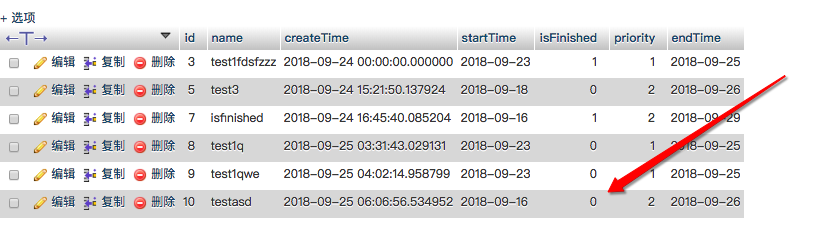
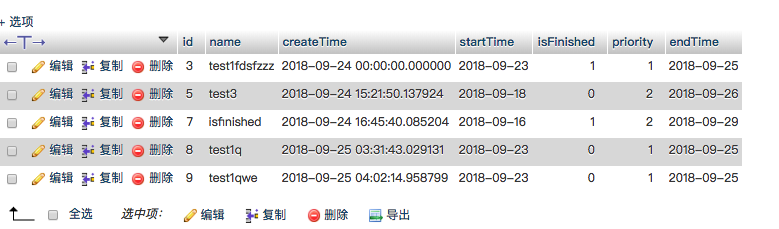
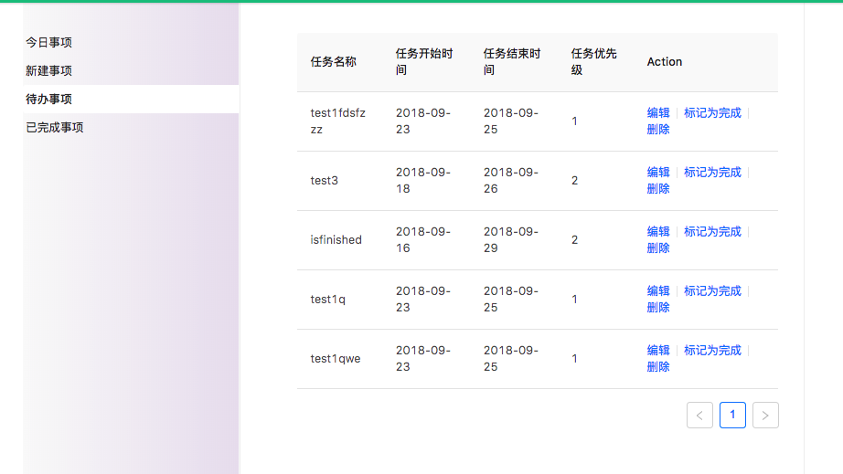
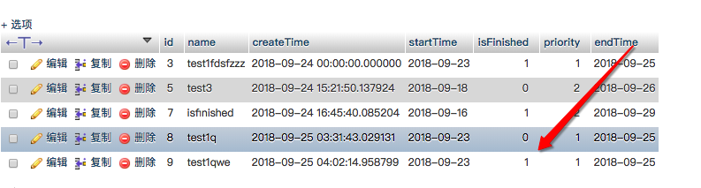
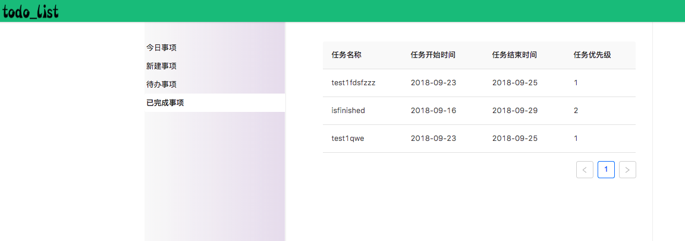

# todo_list
前端react，后端django+django framework
## 已完成功能
### 1 新增一个事件
  
图1 新增事件  
此时数据库的变化如图2所示  
. 
### 2 删除一个事件
  
图3 新增事件  
此时数据库的变化如图4所示  

### 3 列出所有代办事项

### 4 标记一个事件为已完成
. 

此时查看数据库，相应数据中，代表事件是否完成的字段isFinished被置位1. 

. 

同时，在前端的模块"已完成事项中"，可以查看到所有已经标记为完成的事件.   
. 

 